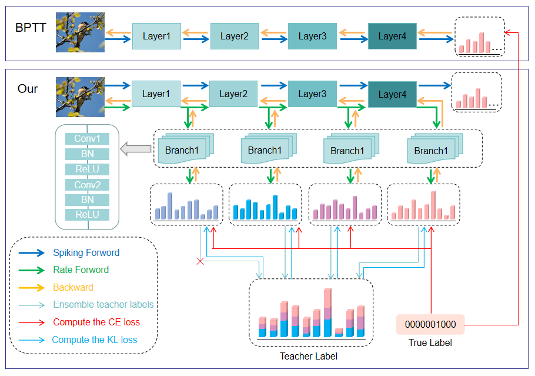

# Enhanced Self-Distillation Framework for Efficient Spiking Neural Network Training


## Abstract
Spiking Neural Networks (SNNs) exhibit exceptional energy efficiency on neuromorphic hardware due to their sparse activation patterns. However, conventional training methods based on surrogate gradients and Backpropagation Through Time (BPTT) not only lag behind Artificial Neural Networks (ANNs) in performance, but also incur significant computational and memory overheads that grow linearly with the temporal dimension. To enable high-performance SNN training under limited computational resources, we propose a enhanced self-distillation framework, jointly optimized with rate-based backpropagation. Specifically, the firing rates of intermediate SNN layers are projected onto lightweight ANN branches, and high-quality knowledge generated by the model itself is used to optimize substructures through the ANN pathways. Unlike traditional self-distillation paradigms, we observe that low-quality self-generated knowledge may hinder convergence. To address this, we decouple the teacher signal into reliable and unreliable components, ensuring that only reliable knowledge is used to guide the optimization of the model. Extensive experiments on CIFAR-10, CIFAR-100, CIFAR10-DVS, and ImageNet demonstrate that our method reduces training complexity while achieving high-performance SNN training.



## Dependencies

- Python >= 3.6
- PyTorch >= 1.7.1
- Spikingjelly
- Torchvision
- Python packages: `pip install numpy matplotlib progress`

## Directory Tree

```
├── experiment
│   ├── cifar
│   │   ├── __init__.py
│   │   ├── config
│   │   └── main.py
│   └── dvs
│       ├── __init__.py
│       ├── config
│       ├── main.py
│       └── process.py
├── model
│   ├── __init__.py
│   ├── abc_model.py
│   ├── layer.py
│   ├── preact_resnet.py
│   └── resnet.py
├── util
│   ├── __init__.py
│   ├── data.py
│   ├── image_augment.py
│   ├── misc.py
│   └── util.py

```

## Usage
## Training

Please run the following code. The hyperparameters in the code are the same as in the paper.

### CIFAR-10

    python experiment/cifar/main.py --seed 60 --arch resnet18 --dataset CIFAR10 --data_path [data_path] --auto_aug --cutout --wd 5e-4 --num_workers 8 --decay 0.2 --T 6 --detach_reset --alp 1.0 --beta 0.3

### CIFAR-100

    python experiment/cifar/main.py --seed 60 --arch resnet18 --dataset CIFAR100 --data_path [data_path] --auto_aug --cutout --wd 5e-4 --num_workers 8 --decay 0.2 --T 6 --detach_reset --alp 1.0 --beta 0.3

### ImageNet
    
    torchrun --nproc_per_node=8 experiment/imagenet/main.py --seed 60 --arch preact_resnet34 --dataset imagenet --data_path [data_path] --auto_aug --cutout --wd 2e-5 --num_workers 16 --decay 0.2 --T 4 --detach_reset --alp 0.7 --beta 0.3
    
